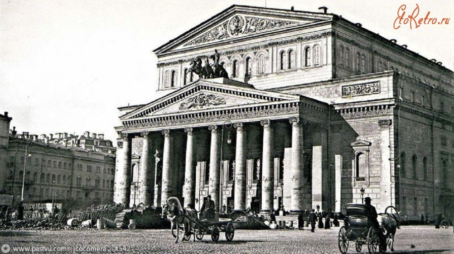

# О нашем театре

Наш театр был основан в 1890 году и с тех пор является культурным достоянием города.

> Наша миссия — нести искусство в массы и открывать новые таланты.

## Наша история

~~Изначально театр был маленьким деревянным зданием на окраине.~~ С 1950 года мы располагаемся в историческом здании в центре города, которое является архитектурным памятником.

[Вернуться на главную](../README.md)